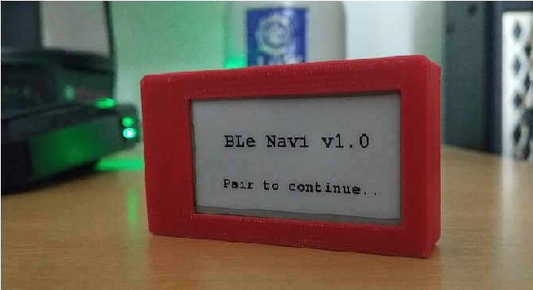

# komoot-eink-navigator
Bluetooth Low Energy companion display for Komoot app

Hardware: Lolin ESP32 eink dev board and a 3d printed case

Important first step:

Edit this file: `%LOCALAPPDATA%\Arduino15\packages\esp32\hardware\esp32\1.0.4\libraries\BLE\src\BLERemoteCharacteristic.cpp`

Remove lines in the `registerForNotify` function before the `else` statement:

```cpp
uint8_t val[] = {0x01, 0x00};
if(!notifications) val[0] = 0x02;
BLERemoteDescriptor* desc = getDescriptor(BLEUUID((uint16_t)0x2902));
desc->writeValue(val, 2);
```

Komoot does not use the `0x2902` descriptor convention

How to use the device :

// One time
1. Run the example BLE server program on the board
2. Pair android device using nrfconnect app.
3. Upload the main.ino program

//Pairing

4. Open the komoot app and navigate to profile>settings>Ble connect
5. Reset the board and wait on the screen and the device will automatically pair 
6. Go back and start the navigation under plan and the display will start updating !



Why this design?

The navigation app keeps the phone display ON during operation. It is hard on the battery life especially when we need to keep it maximum brightness for visibility in outdoor conditions. This companion device solves both these issues by implementing a low power design that has greater visibility in bright outdoor conditions.


